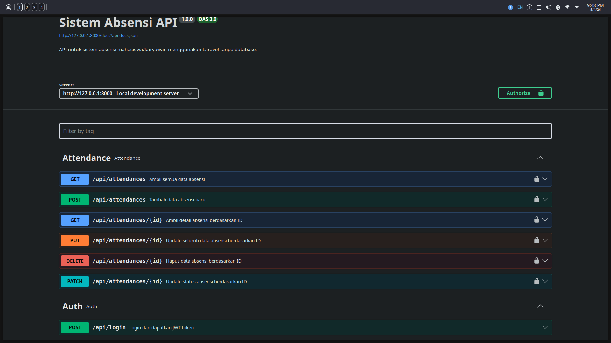

# Sistem Absensi API
**245150701111011 - Dionisius Seraf Saputra**



## Description
Backend API sederhana untuk Sistem Absensi menggunakan Laravel 13. Project ini menggunakan mock data/array tanpa database.

## Tech Stack
- PHP 8.2+
- Laravel 13
- tymon/jwt-auth
- darkaonline/l5-swagger (OpenAPI 3.0)

## Setup

### 1. Clone the repository
```bash
git clone https://github.com/yukienjoyer7/245150701111011-DionisiusSerafSaputra-utptis.git
cd 245150701111011-DionisiusSerafSaputra-utptis
```

### 2. Install dependencies
```bash
composer install
```

### 3. Copy environment file
```bash
cp .env.example .env
php artisan key:generate
```

### 4. Generate JWT secret
```bash
php artisan jwt:secret
```

### 5. Run the server
```bash
php artisan serve
```

## API Documentation
Swagger UI tersedia di: `http://127.0.0.1:8000/api/documentation`

## Dummy Users
| Name | Email | Password |
|------|-------|----------|
| Sakura no Uta | readsnu@absensi.com | password123 |
| Summer Pockets | readsumpock@absensi.com | password123 |

## Endpoints
| Method | URI | Auth | Description |
|--------|-----|------|-------------|
| POST | `/api/login` | No | Login dan dapatkan JWT token |
| GET | `/api/attendances` | Yes | Ambil semua data absensi |
| GET | `/api/attendances/{id}` | Yes | Ambil detail absensi berdasarkan ID |
| POST | `/api/attendances` | Yes | Tambah data absensi baru |
| PUT | `/api/attendances/{id}` | Yes | Update seluruh data absensi |
| PATCH | `/api/attendances/{id}` | Yes | Update status absensi |
| DELETE | `/api/attendances/{id}` | Yes | Hapus data absensi |

## Status Values
`hadir` `izin` `sakit` `alpa`